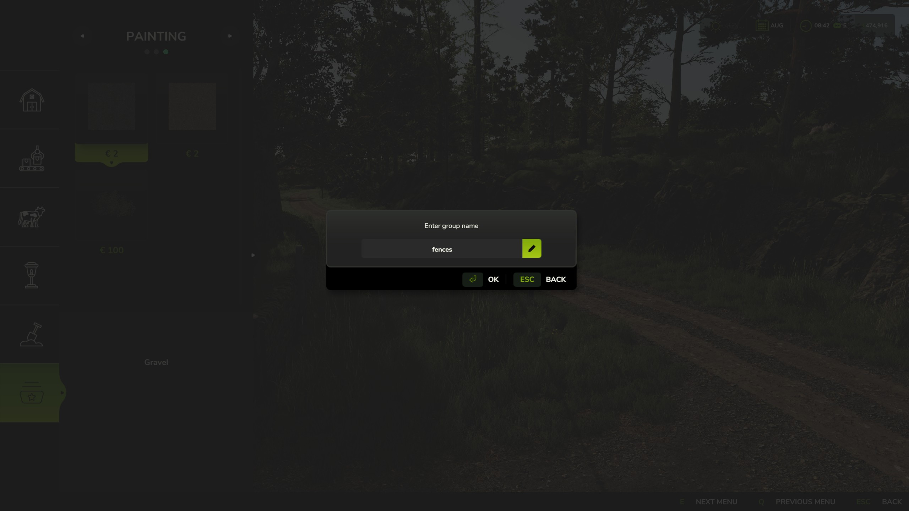

   
  <b>Construction Favorites</b> adds a touch of convenience to your game &mdash;
   
  organize your most used buildings and landscaping tools in custom groups for quick access.
   
   

## Features

- **New "Favorites" Category:** Located right inside the construction menu for easy access.
- **Full Compatibility:** Supports all base game and modded placeables, including landscaping brushes.
- **Customizable Groups:** Create up to 9 groups with unique names and distinct colors.
- **Visual Indicators:** Quickly identify your favorited items by their color-coded star icons.
- **Automatic Cleanup:** Automatically removes favorites from uninstalled mods and DLCs.

## Installation

1. Download the latest version of the mod from the [Releases](https://github.com/modnext/constructionFavorites/releases/) page or the official [ModHub](https://www.farming-simulator.com/mod.php?mod_id=334353&title=fs2025).
2. Copy the downloaded `.zip` file to your Farming Simulator mods folder:
   - Windows: `Documents\My Games\FarmingSimulator2025\mods\`
   - macOS: `~/Library/Application Support/FarmingSimulator2025/mods/`
   - Linux: `~/FarmingSimulator2025/mods/`
3. Start Farming Simulator 2025 and enable the mod in the Mods menu.

## Keybindings

| Key         | Action                                                                   |
| ----------- | ------------------------------------------------------------------------ |
| `T`         | Add or remove the selected item to/from the active favorite group        |
| `G`         | Cycle through favorite groups or create new groups                       |
| `Delete`    | Delete the currently active group                                        |

## Screenshots

## License

Distributed under the GPL-3.0 license. See [LICENSE](https://github.com/modnext/constructionFavorites/blob/main/LICENSE) for more information.
